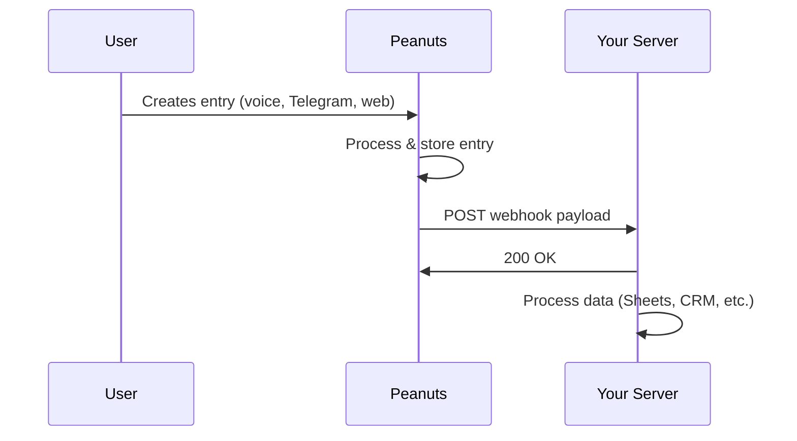

# API Reference

Peanuts uses an **outgoing webhook architecture** to integrate with external systems. Rather than exposing a REST API for you to query, Peanuts pushes data to your endpoints in real-time when events occur.

<Info>
  **Pro Plan Feature** — Webhook integrations require a Pro subscription or higher.
</Info>

## How It Works

When an entry is created, updated, or deleted in any of your Helpers, Peanuts automatically sends an HTTP POST request to your configured webhook URL.



### Benefits of Push Architecture

| Benefit        | Description                                      |
| -------------- | ------------------------------------------------ |
| **Real-time**  | Receive data instantly when events occur         |
| **No polling** | Eliminates the need for scheduled API calls      |
| **Secure**     | Your data stays in Peanuts until you receive it  |
| **Simple**     | Just set up an endpoint and start receiving data |

---

## TypeScript Types

Use these interfaces to type your webhook handlers:

```typescript
/**
 * The complete webhook event payload sent by Peanuts
 */
interface WebhookEvent {
  /** The type of event that triggered the webhook */
  event: "entry.created" | "entry.updated" | "entry.deleted";
  
  /** ISO 8601 timestamp of when the event occurred */
  timestamp: string;
  
  /** Information about the Helper that owns the entry */
  helper: HelperInfo;
  
  /** The entry data that triggered the event */
  entry: EntryData;
}

/**
 * Metadata about the Helper (mini-app)
 */
interface HelperInfo {
  /** Unique identifier for the Helper */
  id: string;
  
  /** Display name of the Helper */
  name: string;
  
  /** The slash command used to create this Helper */
  command: string;
}

/**
 * The entry that was created, updated, or deleted
 */
interface EntryData {
  /** Unique identifier for the entry */
  id: string;
  
  /** 
   * Dynamic key-value pairs matching the Helper's field configuration.
   * Keys are field names, values depend on field type.
   */
  data: Record<string, unknown>;
  
  /** ISO 8601 timestamp of when the entry was created */
  created_at: string;
}
```

<Tip>
  The `entry.data` structure is dynamic and matches the fields you've configured in your Helper. A meal tracker might have `{ calories: 450, meal_type: "lunch" }` while an expense tracker might have `{ amount: 29.99, category: "Transport" }`.
</Tip>

---

## Payload Structure

Here's a complete example of a webhook payload:

```json
{
  "event": "entry.created",
  "timestamp": "2025-01-15T14:32:00.000Z",
  "helper": {
    "id": "abc123-def456-789",
    "name": "Daily Expenses",
    "command": "/expenses"
  },
  "entry": {
    "id": "entry-789-xyz",
    "data": {
      "amount": 42.50,
      "category": "Food & Dining",
      "description": "Team lunch at Olive Garden",
      "date": "2025-01-15"
    },
    "created_at": "2025-01-15T14:32:00.000Z"
  }
}
```

### Event Types

| Event           | Trigger                                          |
| --------------- | ------------------------------------------------ |
| `entry.created` | A new entry is added via voice, Telegram, or web |
| `entry.updated` | An existing entry is modified                    |
| `entry.deleted` | An entry is removed from the Helper              |

---

## HTTP Request Details

Peanuts sends webhooks as HTTP POST requests with the following characteristics:

| Property         | Value                 |
| ---------------- | --------------------- |
| **Method**       | `POST`                |
| **Content-Type** | `application/json`    |
| **User-Agent**   | `Peanuts-Webhook/1.0` |
| **Timeout**      | 30 seconds            |

### Request Headers

```http
POST /your-webhook-endpoint HTTP/1.1
Host: your-server.com
Content-Type: application/json
User-Agent: Peanuts-Webhook/1.0
X-Peanuts-Signature: sha256=a1b2c3d4e5f6...
```

---

## Security & Authentication

All webhook requests are signed using **HMAC-SHA256** to verify authenticity.

### Signature Verification

The `X-Peanuts-Signature` header contains the signature in the format:

```
sha256={hex_encoded_signature}
```

To verify:

1. Extract the signature from the header (remove `sha256=` prefix)
2. Compute HMAC-SHA256 of the raw request body using your webhook secret
3. Compare the signatures using a timing-safe comparison

```typescript
import { createHmac, timingSafeEqual } from 'crypto';

function verifySignature(
  payload: string, 
  signature: string, 
  secret: string
): boolean {
  const expected = createHmac('sha256', secret)
    .update(payload)
    .digest('hex');
  
  const sig = signature.replace('sha256=', '');
  
  return timingSafeEqual(
    Buffer.from(sig, 'hex'),
    Buffer.from(expected, 'hex')
  );
}
```

<Warning>
  Always verify signatures in production to prevent spoofed requests. Your webhook secret is available in your Helper's integration settings.
</Warning>

---

## Response Requirements

Your endpoint should respond quickly to acknowledge receipt:

| Response | Meaning                       |
| -------- | ----------------------------- |
| `2xx`    | Success — delivery confirmed  |
| `4xx`    | Client error — will not retry |
| `5xx`    | Server error — will retry     |

### Retry Policy

If your endpoint returns a 5xx error or times out, Peanuts will retry with exponential backoff:

1. **1st retry**: 1 minute after initial failure
2. **2nd retry**: 5 minutes after 1st retry
3. **3rd retry**: 30 minutes after 2nd retry

After 3 failed attempts, the delivery is marked as failed. You can view delivery history in the Helper's webhook settings.

<Tip>
  Acknowledge webhooks quickly (return 200) and process data asynchronously. This prevents timeouts and ensures reliable delivery.
</Tip>

---

## Quick Start

<CardGroup cols={2}>
  <Card title="Webhooks Tutorial" icon="webhook" href="/tutorials/automations-webhooks">
    Step-by-step guide to setting up your first webhook integration
  </Card>
  <Card title="Troubleshooting" icon="wrench" href="/support/troubleshooting#webhook--integration-errors">
    Common webhook issues and how to resolve them
  </Card>
  <Card title="Zapier Integration" icon="bolt" href="/tutorials/automations-webhooks#popular-destinations">
    Connect Peanuts to 5,000+ apps via Zapier
  </Card>
  <Card title="FAQ" icon="circle-question" href="/support/faq">
    Frequently asked questions about integrations
  </Card>
</CardGroup>